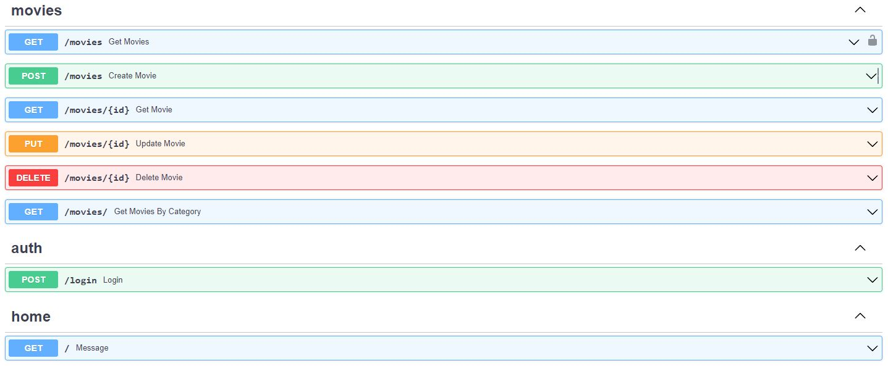

# First App Structure with FastAPI

[ENG]
```
App structure project with FastAPI, using the get, post, put and delete
functions for interacting with the database, aimed for a Movie reviews
website, using data validation,authentication and generation of tokens.
Connected to a database using SQLAlchemy, modularized and structured for
easy access and readability, Ready to Deploy.
```
[SPA]
```
Proyecto de la estructura de una app con FastAPI, con la utilizacion 
de las funciones get, post, put y delete para interactuar con los datos
en formato de películas. 
Incluye validacion de datos, autenticaciones y generacion de tokens.
Conectado a una base de datos utilizando SQLAlchemy, modularizado y con
estructura, Listo para desplegar 
```
